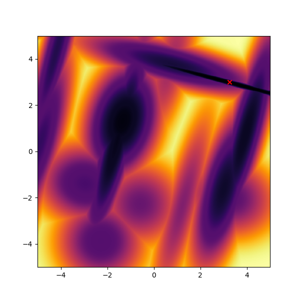

# BBOB torch

Implementation of BBOB functions (Real-Parameter Black-Box Optimization Benchmarking) as specified by https://coco.gforge.inria.fr/downloads/download16.00/bbobdocfunctions.pdf.

All the functions are vectorized and allow to pass potentional solutions in the same `(num_of_solutions, problem_dimension)`.

## Problem description

All the problems are represented by `Problem` class. This class allows to:
- Evaluate your solutions by directly calling it `problem(solutions)`.
- Get problem dimension `problem.dim`.
- Get optimal solution resp. optimal function value using `problem.x_opt` resp. `problem.f_opt`.
- Get boundaries of solution using `problem.min` resp. `problem.max` for each dimension.
- Change underlying type or device using `problem.type(torch.float16)` and `problem.ty(torch.device('cuda:0'))`.

## Problem creation

You can create new instance of each problem by calling corresponding `create_fxx` function. This function accepts problem dimension and can optionally accept device and seed.

```python
import torch
import bbobtorch
problem = bbobtorch.create_f09(40, dev=torch.device('cuda:0'), seed=42)
```

## Example

```python
import matplotlib.pyplot as plt
import numpy as np
import torch
import bbobtorch

x = torch.arange(-5,5, 0.01, dtype=torch.float32)
grid = torch.stack(torch.meshgrid(x, x), -1)
flat_grid = torch.reshape(grid, (-1,2))
xgrid, ygrid = np.meshgrid(x.numpy(), x.numpy())

fn = bbobtorch.create_f22(2, seed=42)  # two dimension with seed 42
results = fn(flat_grid)
results_grid = torch.reshape(results, xgrid.shape) - fn.f_opt

plt.figure(figsize=(6,6))
plt.pcolormesh(xgrid, ygrid, results_grid, cmap='inferno', shading='nearest')
plt.scatter(*fn.x_opt.tolist()[::-1], marker='x', c='r')
plt.show()
```



You can view all the functions in [attached PDF](./rendering.pdf).

--------------

Author: Patrik Valkovič

License: MIT